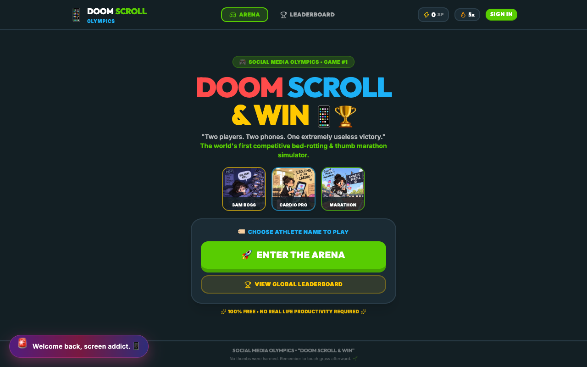
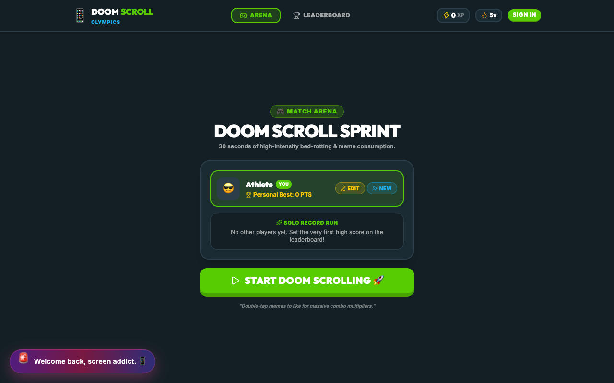
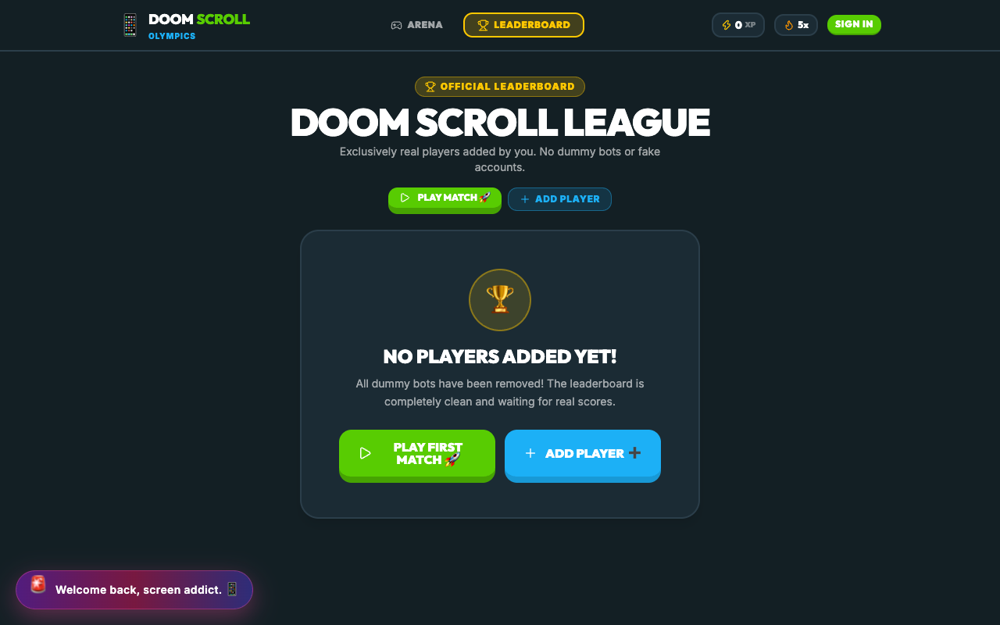
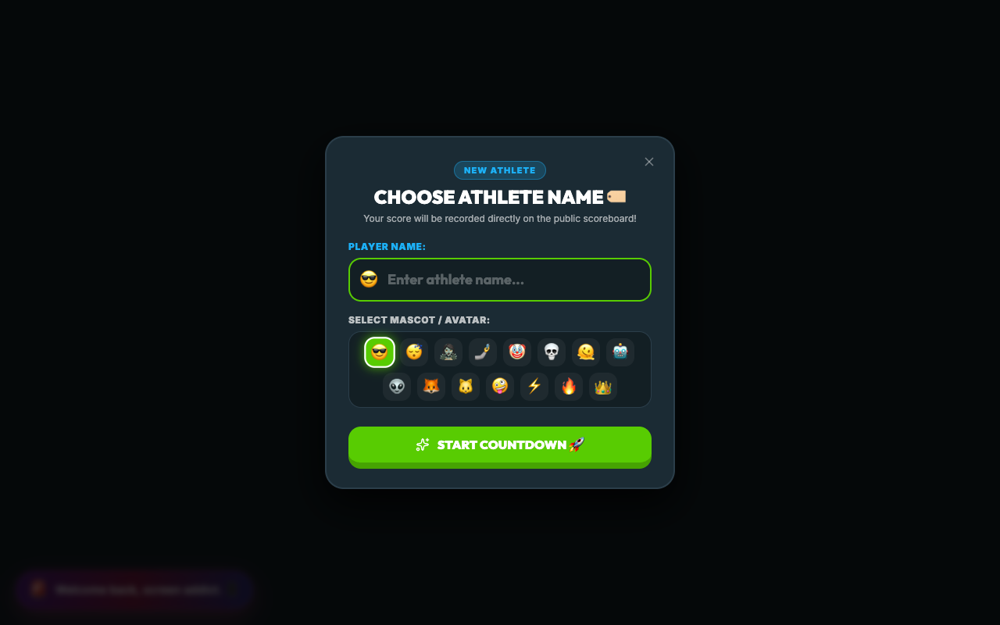
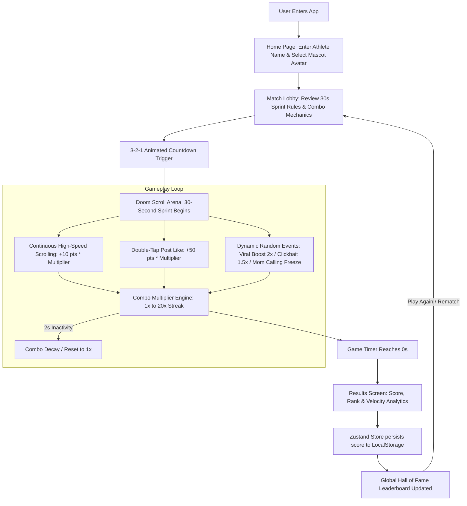

# Social Media Marathon 🎯


## Basic Details
### Team Name: [winners]


### Team Members
- Team Lead: [Ishma Sana P] - [EMEA College Of Arts And Science]
- Member 2: [Anshiba CK] - [EMEA Colllegess  Of Arts And Science]
- Member 3: [Name] - [College]

### Project Description
[our project is a social meadia marathon.It is a fun,fast-paced game where player complete to scroll and react to social media challenge within in a limited time.The player who complete the task within in a limited with the highest speed will win the game]

### The Problem (that doesn't exist)
[It solves the very serious problem of finding out who can waste the most time on social media with maximum speed and minimum productivity]

### The Solution (that nobody asked for)
[We turn mindless scrolling unto a competitive sport tracking who can scroll and complete silly social media tasks the fastest.]

## Technical Details
### Technologies/Components Used
For Software:
- **Languages:** TypeScript, JavaScript (ESNext), HTML5, CSS3
- **Frontend Framework:** React 19 (`react`, `react-dom`)
- **Routing:** React Router DOM v7 (`react-router-dom`)
- **State Management:** Zustand 5 (`zustand` with persistent `localStorage` synchronization for user profiles, game records, and leaderboard rankings)
- **Styling & Design System:** Tailwind CSS 3.4 (custom tactile 3D arcade buttons, dark mode palette, responsive viewport layout), PostCSS, Autoprefixer
- **Animations & Physics:** Framer Motion 13 (`framer-motion`) for fluid page transitions, tactile button bounce physics, combo HUD meters, and floating score popups
- **Icons & Visuals:** Lucide React (`lucide-react`), custom SVG symbol sprite system, and canvas-based celebratory confetti
- **Build Tools & Linters:** Vite 5 (ultra-fast Hot Module Replacement / HMR bundler), Oxlint, TypeScript Compiler (`tsc`)

For Hardware:
- *N/A (Purely software-based web application)*
- **Supported Devices:** Any modern PC, laptop, tablet, or smartphone
- **Required Software:** Modern web browser (Google Chrome, Firefox, Safari, Edge, Brave)
- **Input Tools:** Mouse scroll wheel, multi-touch trackpad, or capacitive touchscreen (calibrated for high-velocity finger/thumb scrolling)

### Implementation
For Software:
# Installation
```bash
# 1. Clone the repository
git clone https://github.com/Ishmanazar/Winners.git
cd Winners

# 2. Install required npm dependencies
npm install
```

# Run
```bash
# Start local development server with Vite HMR
npm run dev

# The app is now live at http://localhost:5173
```

```bash
# Build optimized production bundle
npm run build

# Preview production build locally
npm run preview
```

### Project Documentation
For Software:

# Screenshots (Add at least 3)

*Home Page — Athlete onboarding, custom avatar selection, career stats overview, and direct arena launchpad.*


*Game Sprint Lobby — 30-second rapid sprint rules briefing, scoring breakdown, and combo multiplier guide.*


*Official Leaderboard — Real-time rankings of top doom-scrollers, personal best records, and persistent localStorage sync.*


*Arena Launch — Athlete configuration and countdown preparation before the high-velocity doom-scroll marathon.*

# Diagrams

*Complete application architecture and gameplay loop: from athlete onboarding to real-time combo scoring and persistent leaderboard ranking.*

For Hardware:

# Schematic & Circuit
*N/A — Pure software web application. No physical electronic circuitry or hardware schematics required.*

# Build Photos
*N/A — Pure software web application. No physical components or hardware assembly involved.*

### Project Demo
# Video
[Add your demo video link here]
*Demonstrates a 30-second high-velocity doom scroll marathon, combo chaining up to 20x, random event popups, and instant leaderboard synchronization.*

# Additional Demos
[Add any extra demo materials/links]

## Team Contributions
- [Name 1]: [Specific contributions]
- [Name 2]: [Specific contributions]
- [Name 3]: [Specific contributions]

---
Made with ❤️ at TinkerHub Useless Projects 


