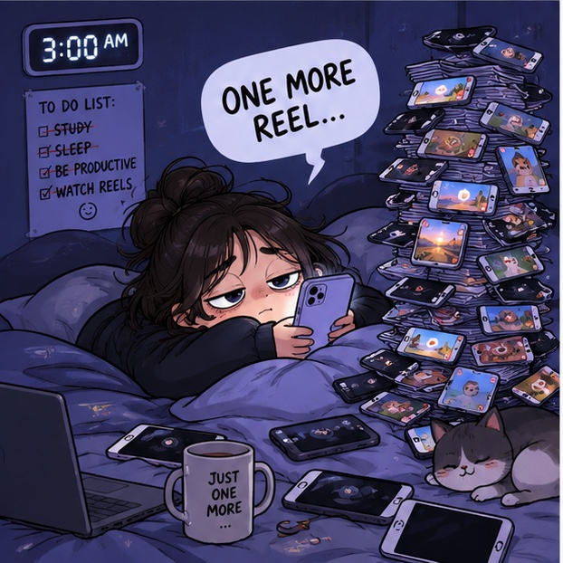
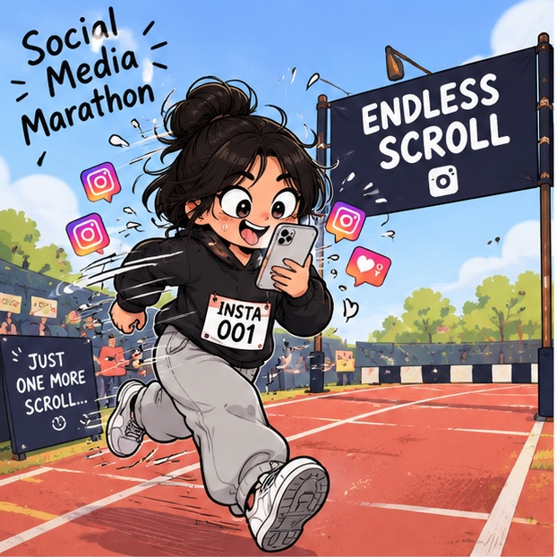

# 📱 DOOM SCROLL & WIN 🏆
### *The World's Most Ridiculous Doom Scrolling Competition — Game #1 of the Social Media Olympics*

<div align="center">


[](https://react.dev/)
[](https://www.typescriptlang.org/)
[](https://vitejs.dev/)
[](https://tailwindcss.com/)
[](https://www.framer.com/motion/)
[](https://github.com/pmndrs/zustand)

<p align="center">
  <strong>"Two players. Two phones. One extremely useless victory."</strong><br>
  <em>The world's first competitive bed-rotting & thumb marathon simulator.</em>
</p>

[🎮 Play The Game](#-getting-started) • [🔥 Gameplay Mechanics](#-gameplay-mechanics--scoring) • [🏆 Athletes](#-the-athletes) • [⚡ Random Events](#-random-events) • [🛠️ Tech Stack](#️-technology-stack)

</div>

---

## 📖 Overview

Modern algorithms were engineered to trap our brains in an endless dopamine spiral. **DOOM SCROLL & WIN** flips the script, transforming digital self-destruction into an elite, adrenaline-fueled Olympic e-sport.

Step into the arena with **30 seconds** on the clock. Your objective:
- **Scroll** through algorithmic brainrot at blistering speeds
- **Like** viral posts to chain massive point multipliers
- **Dodge** boring zero-value content
- **Survive** panic interruptions like Mom calling at 3:00 AM
- **Crown yourself** the undisputed Bed-Rotting Champion on the real-player leaderboard!

---

## ✨ Key Features

- **⚡ Algorithmic Doom Feed**: Realistic vertical scroll simulation packed with satirical tech memes, relatable late-night thoughts, and absurd internet commentary.
- **🔥 Dynamic Combo & Multiplier System**: Chain rapid scrolls and likes together to build up to a **20x multiplier** before the 2-second decay timer breaks your streak.
- **🚨 Interactive Random Events**:
  - 🚀 **Viral Post**: Skyrockets engagement with a **2x multiplier**.
  - 🎣 **Clickbait**: Tempting hooks granting a **1.5x score boost**.
  - 😴 **Boring Post**: Zero value! Skip immediately to save precious seconds.
  - 🔄 **Infinite Loop**: Hypnotic engagement loop boosting scrolls by **3x**.
  - 📞 **Mom Calling!**: A 2-second heart-stopping panic event where scoring freezes—answer or dismiss!
- **🏆 Real-Player Hall of Fame**:
  - Fully dynamic local leaderboard with zero synthetic dummy bots.
  - Tracks individual high scores, ranks (🥇 Gold, 🥈 Silver, 🥉 Bronze), athlete avatars, scroll velocity, and total likes.
  - Persistent browser storage (`localStorage`) so rivalries continue across sessions.
- **🎨 Duolingo-Inspired Gamified UI**:
  - Chunky, tactile 3D buttons with press-down physics and micro-animations.
  - Animated combo meters, floating score pops, custom confetti celebration cannons, and satirical notification toasts.
  - Ambient arcade background with floating geometric grid and neon accents.
- **🏷️ Athlete Profile Onboarding**: Quick athlete creation and avatar selection with instant detection of returning champions.

---

## 🏅 The Athletes

Choose your persona or customize your own:

| Athlete | Title | Specialty | Bio |
| :---: | :---: | :---: | :--- |
|  | **The 3AM Phone Zombie** | *Endurance Bed-Rotting* | Hasn't seen sunlight since Tuesday. Powered strictly by blue light, caffeine, and existential dread. |
|  | **Thumb Cardio Champion** | *High-Velocity Swiping* | Clocks 120 scrolls per minute. Medical thumb insurance strongly recommended. |
|  | **Olympic Algorithm Decathlete** | *Precision Multipliers* | Master of the 20x combo multiplier. Dodges boring posts with superhuman reflexes. |

---

## 🎮 Gameplay Mechanics & Scoring

| Action / Event | Base Score | Multiplier | Strategy |
| :--- | :---: | :---: | :--- |
| **Scroll Down** | `+10 pts` | `1x - 20x` | Keep continuous motion without pausing. |
| **Like Post (Double-Tap / Heart)** | `+50 pts` | `1x - 20x` | Double points boost; increases combo meter. |
| **Fast Interaction Streak** | `+100 pts` | Current Multiplier | Rewarded for lightning-fast consecutive inputs. |
| **Combo Chain** | Multiplier steps | Up to `20x` | Increases with every valid action within 2000ms. |
| **Combo Decay** | Breaks to `1x` | Reset | Triggers if no action is registered within 2 seconds. |
| **Game Duration** | — | — | 30-second rapid-fire sprint. |

---

## 🚨 Random Events

During a round, algorithmic anomalies can trigger at any moment:

```
┌─────────────────┬──────────────┬───────────────────────────────────────────┐
│ Event           │ Multiplier   │ Description                               │
├─────────────────┼──────────────┼───────────────────────────────────────────┤
│ 🚀 VIRAL POST   │ 2.0x         │ Post is blowing up! Spam likes immediately│
│ 🎣 CLICKBAIT    │ 1.5x         │ You won't believe what happens next...    │
│ 😴 BORING POST  │ 0.0x         │ No engagement value. Scroll past ASAP!    │
│ 🔄 INFINITE LOOP│ 3.0x         │ Can't stop scrolling this hypnotic loop!  │
│ 📞 MOM CALLING  │ FREEZE (2s)  │ "Quick, pretend you were studying!"       │
└─────────────────┴──────────────┴───────────────────────────────────────────┘
```

---

## 🛠️ Technology Stack

- **Framework**: [React 19](https://react.dev/) + [TypeScript](https://www.typescriptlang.org/)
- **Build Tool**: [Vite 5](https://vitejs.dev/) with hot module replacement
- **State Management**: [Zustand 5](https://github.com/pmndrs/zustand) with custom `localStorage` sync
- **Styling**: [Tailwind CSS 3.4](https://tailwindcss.com/) with bespoke Duolingo-style 3D arcade design tokens
- **Animations**: [Framer Motion 12](https://www.framer.com/motion/) (page transitions, tactile button physics, HUD combos)
- **Icons**: [Lucide React](https://lucide.dev/) + custom vector SVG sprite system
- **Sound & Effects**: Canvas-based dynamic confetti, score popups, and random humor toast notifications

---

## 📁 Project Architecture

```
social-media-marathon/
├── public/
│   ├── assets/                 # High-resolution character & banner art
│   ├── favicon.svg             # Custom vector SVG favicon
│   ├── favicon.png             # 64x64 PNG browser icon
│   ├── favicon.ico             # Multi-size Windows ICO resource
│   ├── apple-touch-icon.png    # 180x180 iOS touch icon
│   └── icons.svg               # SVG symbol sprite sheet
├── src/
│   ├── assets/                 # Bundled visual assets & character illustrations
│   ├── components/
│   │   ├── layout/             # AppNavbar, navigation bars & headers
│   │   ├── leaderboard/        # Leaderboard cards, medals, and score tables
│   │   └── ui/                 # 3D Buttons, modals, confetti, toasts, arcade backdrop
│   ├── data/
│   │   ├── mockPosts.ts        # Satirical feed posts, usernames, and content
│   │   └── mockPlayers.ts      # Ranking algorithms and score utilities
│   ├── games/
│   │   └── doom-scroll/        # Core game: HUD, Feed, Countdown, Timer, ResultsScreen
│   ├── pages/
│   │   ├── Home.tsx            # Landing page & athlete onboarding
│   │   ├── Lobby.tsx           # Pre-game lobby & controls briefing
│   │   ├── DoomScroll.tsx      # Main game viewport & state coordinator
│   │   └── LeaderboardPage.tsx # Full-screen Hall of Fame
│   ├── store/
│   │   └── gameStore.ts        # Unified Zustand store (scores, combos, players, events)
│   ├── types/
│   │   ├── game.ts             # Game state enums, event types, config interfaces
│   │   ├── player.ts           # Player profiles, rankings, and avatar types
│   │   └── post.ts             # Social media post schemas
│   ├── App.tsx                 # Animated routing & global providers
│   ├── index.css               # Arcade design system & utility classes
│   └── main.tsx                # Application root entry point
├── index.html                  # HTML entry with responsive & SEO meta tags
├── package.json                # Project dependencies and npm scripts
├── tailwind.config.js          # Gamified color palette, fonts & animations
└── vite.config.ts              # Vite bundler configuration
```

---

## 🚀 Getting Started

### Prerequisites

- [Node.js](https://nodejs.org/) (version 18.0 or higher recommended)
- [npm](https://www.npmjs.com/) (version 9.0 or higher)

### Installation

1. **Clone the repository:**
   ```bash
   git clone https://github.com/Ishmanazar/Winners.git
   cd Winners
   ```

2. **Install project dependencies:**
   ```bash
   npm install
   ```

3. **Start the local development server:**
   ```bash
   npm run dev
   ```
   Open [http://localhost:5173](http://localhost:5173) in your browser.

4. **Build for production:**
   ```bash
   npm run build
   ```

5. **Preview production build locally:**
   ```bash
   npm run preview
   ```

---

## ⚙️ Game Configuration & Customization

All game balance parameters are centrally managed in [`src/types/game.ts`](file:///Users/afeefev/Documents/projects/ishma/social-media-marathon/src/types/game.ts). You can easily customize game duration, multipliers, and points:

```typescript
export const DEFAULT_GAME_CONFIG: GameConfig = {
  duration: 30,               // Game duration in seconds
  scrollPoints: 10,           // Points per scroll tick
  likePoints: 50,             // Points per liked post
  fastInteractionPoints: 100, // Bonus for rapid consecutive actions
  comboDecayMs: 2000,         // Milliseconds before combo streak drops
  maxComboMultiplier: 20,     // Maximum achievable combo multiplier
};
```

---

## 🗺️ Social Media Olympics Roadmap

*DOOM SCROLL & WIN* is Game #1 in the Social Media Olympics series. Future events in development:

- [ ] **Game #2: Notification Dodgeball** 🔔 — Deflect, swipe away, and silence an avalanche of spam notifications before your screen shatters.
- [ ] **Game #3: Rage-Bait Sprint** 🤬 — Read infuriating comment sections while holding your heart rate below the red line.
- [ ] **Game #4: Story Tapping Decathlon** ⚡ — Tap through 500 consecutive Instagram stories without missing a real update.
- [ ] **Multiplayer Battle Mode** ⚔️ — Real-time 1v1 head-to-head doom-scrolling via WebSockets.

---

## 📄 License & Attribution

Created for the **Social Media Olympics**. Built with ❤️, satire, and excessive screen time.

*Disclaimer: No actual thumbs were permanently damaged in the making of this game. Remember to touch grass occasionally.*
